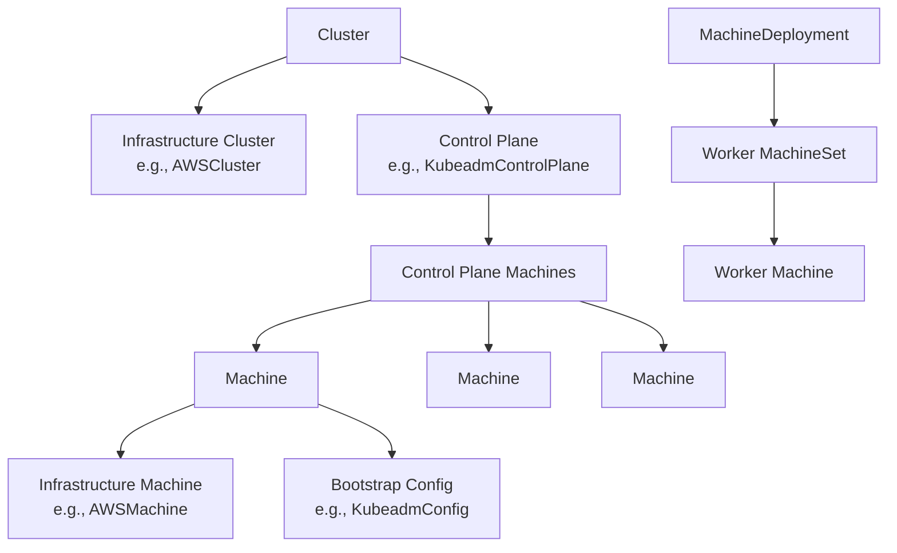

# Cluster API Architecture

## Overview

Cluster API (CAPI) is a Kubernetes project that brings declarative, Kubernetes-style APIs to cluster creation, configuration, and management. CAPI provides a consistent way to manage Kubernetes clusters across different infrastructure providers.

## Core Concepts

### Clusters
The `Cluster` resource (`cluster.x-k8s.io/v1beta1`) represents a Kubernetes cluster. It contains:
- Cluster network configuration (pod/service CIDRs, API server configuration)
- Reference to infrastructure provider resources
- Reference to control plane provider
- Status and conditions

Example from the management cluster:
- Namespace: `org-giantswarm`
- Cluster: `alba`
- Provider: AWS
- Phase: Provisioned

### Machines
The `Machine` resource represents a host for running Kubernetes nodes. Machines can be:
- Control plane nodes
- Worker nodes

Each machine has:
- Reference to bootstrap configuration
- Reference to infrastructure-specific machine
- Node reference once provisioned
- Provider ID

### Infrastructure Providers

CAPI supports multiple infrastructure providers:

#### AWS (`infrastructure.cluster.x-k8s.io`)
- `AWSCluster` - AWS-specific cluster configuration (VPC, subnets, etc.)
- `AWSMachine` - EC2 instance specifications
- `AWSMachineTemplate` - Reusable machine configurations
- `AWSMachinePool` - Auto-scaling groups

#### Azure, GCP, vSphere
Similar patterns with provider-specific resources.

### Control Plane Providers

#### KubeadmControlPlane (`controlplane.cluster.x-k8s.io`)
- Manages control plane machines as a set
- Handles control plane scaling and upgrades
- Ensures etcd quorum

#### Managed Control Planes
- `AWSManagedControlPlane` - EKS control plane
- `ROSAControlPlane` - Red Hat OpenShift on AWS

### Bootstrap Providers

#### Kubeadm (`bootstrap.cluster.x-k8s.io`)
- `KubeadmConfig` - Bootstrap configuration for machines
- `KubeadmConfigTemplate` - Reusable bootstrap configurations

## Resource Relationships

## Cluster Lifecycle

### Creation Flow
1. User creates Cluster resource
2. Infrastructure provider creates cloud resources (VPC, networks)
3. Control plane provider creates control plane machines
4. Bootstrap provider generates node initialization data
5. Machines join the cluster
6. Cluster becomes Ready

### Phases
- `Pending` - Initial state
- `Provisioning` - Infrastructure being created
- `Provisioned` - Infrastructure ready
- `Deleting` - Cluster being deleted
- `Failed` - Error state

## Controller Architecture

CAPI uses the controller pattern:
- Each provider runs controllers for its resources
- Controllers watch for changes and reconcile desired state
- Controllers update resource status and conditions

## Key Features

### Declarative API
All operations are declarative through Kubernetes resources.

### Provider Agnostic
Core CAPI APIs work across all infrastructure providers.

### Lifecycle Management
- Cluster creation and deletion
- Scaling (add/remove nodes)
- Upgrades (Kubernetes version)
- Health monitoring

### Multi-tenancy
Clusters are namespace-scoped, enabling multi-tenant management clusters.

## Next Steps

This document will be expanded with:
- Detailed provider analysis
- ClusterClass and managed topologies
- Upgrade strategies
- Best practices
- Troubleshooting guides 